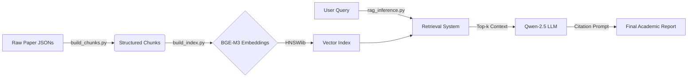

# AcademicTextGenerator
**End-to-end Academic RAG pipeline using Qwen-2.5 and BAAI/bge-m3 with precise citation resolution and HNSW indexing.**


## Overview

**Academic-Qwen-RAG** is a specialized Retrieval-Augmented Generation (RAG) framework designed for conducting deep literature reviews. Unlike generic RAG systems, this pipeline focuses on preserving the integrity of academic references.

It processes raw academic papers (JSON), indexes them using high-dimensional embeddings, and generates scientifically accurate answers with **strict inline citations** using the **Qwen-2.5-7B-Instruct** model.

## Key Features

* **Smart Chunking Strategy:** Parses academic papers while preserving section hierarchy and resolving inline citations (e.g., mapping `(Smith, 2020)` to the correct bibliography entry).
* **High-Performance Indexing:** Utilizes **BAAI/bge-m3** embeddings (8192 context length) and **HNSWlib** for millisecond-latency approximate nearest neighbor search.
* **Citation-Aware Inference:** A custom prompt engineering pipeline ensures the LLM:
    * Re-indexes sources sequentially (e.g., `[1]`, `[2]`).
    * Avoids hallucinations by strictly adhering to retrieved context.
    * Distinguishes between primary and secondary sources.
* **Detailed Reporting:** Generates a dual-view output: the synthesized answer and a detailed "Reference Table" showing exactly which chunks were used and their relevance scores.

## Architecture



## Installation
To run this project, you need a Python environment with GPU support (highly recommended for embeddings and LLM inference).

### Prerequisites
* Python 3.10+
* NVIDIA GPU (CUDA 11.8 or higher recommended)

### 1. Clone the Repository
```bash
git clone [https://github.com/Batuminien/Academic-Qwen-RAG.git](https://github.com/yourusername/Academic-Qwen-RAG.git)
cd Academic-Qwen-RAG
```

### 2. Install Dependencies
It is critical to install PyTorch with CUDA support before installing other requirements to ensure the GPU is utilized.
```bash
pip install -r requirements.txt
```

## Configuration
The scripts currently use path variables that need to be updated to match your local directory structure. Open the files and locate the configuration sections at the top:
* **build_chunks.py**:
  * Update *data_dir*: Path to your folder containing raw JSON papers.
  * Update *output_path*: Where the processed *.jsonl* file should be saved
* **build_index.py**:
  * Update *CHUNKS_PATH*: Point this to the output file from step 1.
  * Update *INDEX_DIR*: Directory where the HNSW index binary will be saved.
* **rag_inference.py**:
  * Update *BASE_DIR* or *INDEX_PATH*: Ensure it points to the index directory created in step 2.

##Usage Pipeline
The project follows a linear Extract, Transform, Load & Inference pipeline:

### Step 1: Chunking
Parses raw JSONs, resolves references, and creates semantic chunks.
```bash
python build_chunks.py
```
*Output: chunks.jsonl*

### Step 2: Embedding
Generates BGE-M3 embeddings and builds the HNSW vector index.
```bash
python build_index.py
```
*Output: hnsw_index.bin and metadatas.jsonl*

### Step 3: Inference
Runs the RAG system. Modify the *query* variable in the script to ask different questions.
```bash
python rag_inference.py
```
*Output: Displays the generated academic answer and the citation table.*

## Project Structure
```
Academic-Qwen-RAG/
├── data/
│   ├── jsons/              # Place your raw paper JSON files here
│   ├── chunks/             # Generated structured chunks (chunks.jsonl)
│   └── index/              # Generated vector index and metadata
├── scripts/
│   ├── build_chunks.py     # Script: preprocessing and citation resolution
│   ├── build_index.py      # Script: embedding and indexing
│   └── rag_inference.py    # Script: retrieval and Generation (Main Entry)
├── requirements.txt        # Python dependencies
└── README.md               # Project documentation
```

## Models Used
| Component | Model Name | HuggingFace Link | Description |
| :--- | :--- | :--- | :--- |
| **LLM** | `Qwen/Qwen2.5-7B-Instruct` | [Link](https://huggingface.co/Qwen/Qwen2.5-7B-Instruct) | A powerful instruction-tuned model excelling in reasoning and long-context understanding. |
| **Embeddings** | `BAAI/bge-m3` | [Link](https://huggingface.co/BAAI/bge-m3) | State-of-the-art dense retrieval model supporting 8192 token context and multi-linguality. |
